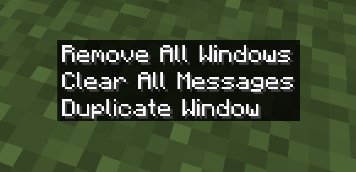
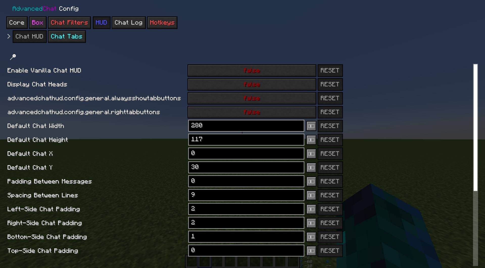
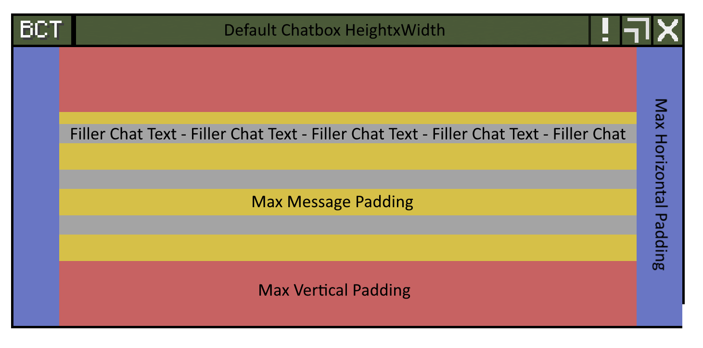
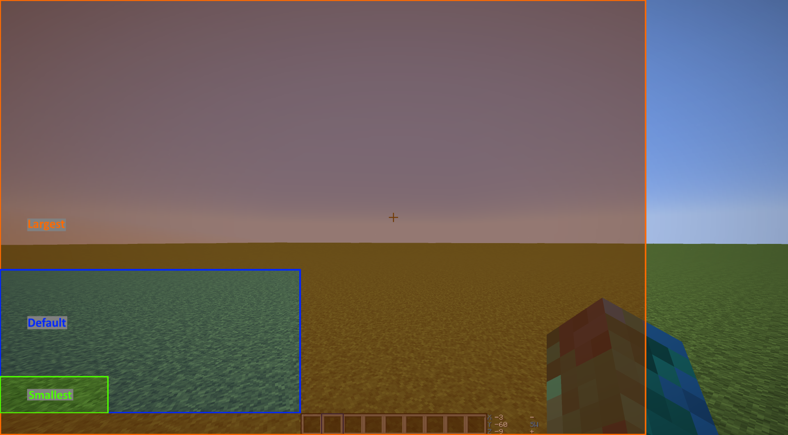
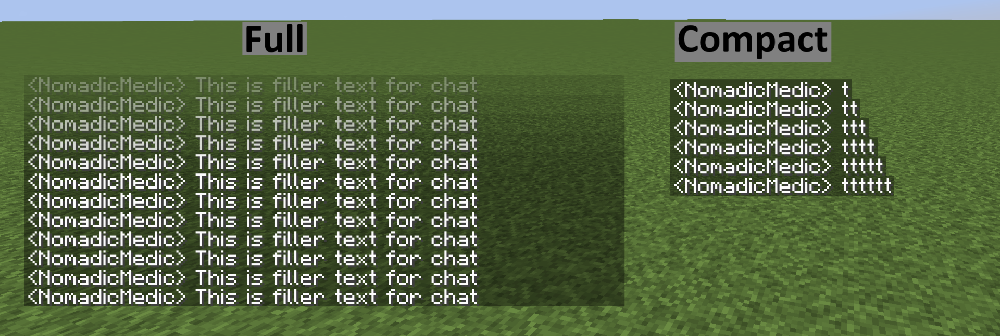

# AdvancedChat - ChatHUD Module

  

    Table of contents
  

  {: .text-delta }
1. TOC
{:toc}

---

## AdvancedChat - ChatHUD
- Create chat tabs and a good looking HUD.

## Overview
{:toc}  
The information on this page is for the features of the ChatHUD module of AdvancedChat. You can see the available sections in the Table of Contents, listed above.

---
## Available Tabs and Settings
{:toc}  
The following section will go over all the available tabs and settings in each tab that you can modify. This information can also be found [here](https://darkkronicle.github.io/AdvancedChatCore/modules/modulesOverview.html),
in the AdvancedChat-Modules Overview section. As well as overviews for all other modules available as of January 31st 2022.  

<u>*ACC Page Guide*</u>  
  

**In Game Buttons**  
Pressing the chat key to open the chat, the following buttons will be available; 
- Exclamation Mark (*Chat window*) - This symbol when clicked has 3 options that modify the windows render of new messages and are as follows;
	- Exclamation Mark - Vanilla default  
	- Thumbtack - Always focused 
	- Square - Never focus
- Nested 90° Lines (*Chat window*) - For resizing the current chatbox.  
- X (*Chat window*)- This will remove the respective AdvancedChat Window. 
- Plus Sign (*Relative to listed tabs above player text entry*)- Will create a new chat window for the currently selected Tab.
- Trash Can (*Relative to listed tabs above player text entry*)- This will remove all currently open AdvancedChat boxes. 
- Bars (*bottom right*)- A chat page with the option to filter at the top with a **Filter Type** button that cycles the options listed under AdvancedChatFilters>Chat Filters Tab>Filter Type.   
- Cog Wheel (*bottom right*)- Opens the configuration menu for the AdvancedChatHUD Chat Tabs.

There is also an added right click context menu when your chat is open that has the following options;  
- Remove All Windows - Removes all windows currently displayed.
- Clear All Messages - Clears all messages from the chatbox.  
- Duplicate Window - Duplicates the current window.

<u>*Right Click Context Menu*</u>  

***Chat HUD Tab***  
- Enable Vanilla Chat HUD - Enables the Vanilla Chat HUD that acts mostly like a Chat Window. (*Vanilla Chat HUD can use Chat Tabs if you click on it and then change the tab*)  
- Display Chat Heads - Whether or not the head of the message sender displays besides their message.
- Always Show Tab Buttons - Whether or not to constantly show the tab buttons. 
- Right Tab Buttons - Whether or not to push the tab buttons to the right side of the screen.  
- Default Chat Width - The width of the Chat HUD (Overrides vanilla chat width)
- Default Chat Height - The height of the Chat HUD (Overrides vanilla chat height)
- Default Chat X - The x-coordinate of the chat box, starting at the bottom-left side of the screen.
- Default chat Y - The y-coordinate of the chat box, starting at the bottom-left side of the screen.
- Padding Between Messages - How much space should be between individual messages.
- Spacing Between Lines - The space in pixels between lines of chat.
- Left-Side Chat Padding - The amount of space between the left side of the chat box to where the text starts.
- Right-Side Chat Padding - The amount of space between the right side of the chat box to where the text breaks.
- Bottom-Side Chat Padding - The amount of space between the bottom of the chat box to the newest message.
- Top-Side Chat Padding - The amount of space between the top of the chat box to the oldest message.
- Chat Visibility - What behavior of the visibility the Chat HUD should be. 
	- **Vanilla** - Chat HUD renders as it does in Vanilla.
	- **Always** - Renders the Chat HUD at all times.
	- **Focus Only** - Renders the Chat HUD only if the Chat Box is open.
- Chat Scale - How big or small the text inside of the chat box is. (Does not affect the size of the Chat HUD.)
- Fade Speed - How quickly a message takes to fade-out.
- Time Until Fade - The number of ticks before newly received messages begin to disappear.
- Fade Style - The easing function used for the fade animation. (Vanilla uses linear easing)
- Empty Text Color - The color of text without formatting using HEX+Alpha values.
- Background Line Style - How the background of the unfocused Chat HUD is fitted to the messages. 
	- **Full** - Fits the background width of the Chat HUD. 
	- **Compact** - Fits the background to the length of each respective line.
- Striped Messages - Whether or not the backgrounds of every other message is colored differently to create a striped effect.
- Stored Lines - The maximum amount of lines stored in Chat HUD (Excessively large values may cause memory errors)

<!--<u>*Chat HUD TAB*</u>  
--> 

***Chat Tabs Tab***  
By default there is already the Main Chat Tab listed. Other than that there are two buttons available. Import Tab, and New Chat Tab.
The import tab just like with the other modules is used to import an already made Chat Tab. The New Chat Tab provides a new chat tab to configure or delete.
Chat Tabs have the following options to configure as well as the option to export;  
- Tab Name - What the tab shows up as in the config.
- Starting Message - What text shows up when the tab is focused.
- Tab HUD Abbreviation - What the tab shows up as on the side of the Chat HUD if Show Chat Tabs is enabled under Chat HUD settings.
- Accent Color - The accent color of the chat tab using HEX+Alpha values.
- Border Color - The color of the outline of the chat tab using HEX+Alpha values.
- Background Color - The color of the background of the chat tab using HEX+Alpha values.
- Show Unread Messages - Whether or not the number of unread messages are displayed for the chat tab.  

<!--<u>*Chat Tabs TAB*</u>  
-->  

---
## Settings Deep Dive
{:toc}
This section will take the above section, Available Tabs and Settings, and break down each one into their own separate sections to help fully understand what each one does respectively and in more easy to understand terms. As well as providing screen shots of their locations and more in-depth media in the Examples Sections located below.

When you get into the game after installing the mod you will have by default have a premade Chat tab and its respective window, plus the vanilla chat box. As well as some buttons that will always be there even if you delete all of your tabs. 

***Buttons***  
Pressing your chat key to open the chat, the following buttons will be available to you; 
- <u>Exclamation Mark</u> - Located in the Chat window. This symbol when clicked has 3 options that modify the windows render of new messages (*Like Chat Visibility listed in the above section* **Chat HUD Tab**) and are as follows;
	- **Exclamation Mark** - Is the vanilla default. 
	- **Thumbtack** - Will always keep chat open. 
	- **Square** - Will never focus chat.
- <u>Nested 90° Lines</u> - Located in the Chat window. For resizing the current chatbox.  
- <u>X Symbol</u> - Located in the Chat window. This will remove the respective AdvancedChat Window. 
- <u>Plus Sign</u> - Is relative to listed tabs above where you type your messages. It will create a new chat window for the currently selected Tab.
- <u>Trash Can</u> - Is relative to listed tabs above where you type your messages. This will remove all currently open AdvancedChat boxes. 
- <u>Bars</u> - Located in the bottom right of your screen. This will open a chat page with the option to filter at the top with a **Filter Type** button next to the search box that cycles the following options;  (*Pst it's the same ones that are listed under [here](https://darkkronicle.github.io/AdvancedChatCore/modules/modulesOverview.html) AdvancedChat Modules>AdvancedChatFilters>Chat Filters Tab>Filter Type*) 
	- **Literal**, exact match. 
	- **Upper-Lower**, literal but not case-sensitive.
	- **RegEx**, Parses the strings as Regular Expression.
	- **All**, Passes all text through the filter regardless of the string to find.
- <u>Cog Wheel</u> (bottom right)- Opens the configuration menu for the AdvancedChatHUD Chat Tabs.

<u>*Default View*</u>

***Chat Information Modifications:*** Any settings in the ChatHUD module that will modify the information in the Chatbox.
  
- <u>Display Chat Heads</u> - This can either be toggled on or off. If it is set to true then the respective head of the sender is displayed to the left of the username. There is a similar setting in the *General Tab* for time that is discussed in the Overview Page as of right now (January 31st 2022.)
- <u>Always Show Tab Buttons</u> - Whether or not to constantly show the tab buttons that are located in your chat box. 
- <u>Right Tab Buttons</u> - Whether or not to push the tab buttons to the right side of the screen to make for a cleaner look.  

<u>*Chat Heads*</u>
  
<!--<u>*Chat TAB Buttons Display*</u>  
-->
<u>*Chat Tab Buttons shifted Right*</u>  
  

***Chat Text Modifications:*** Any settings in the ChatHUD module that will modify the text within the Chatbox. 
  
- <u>Padding Between Messages</u> - This is the amount of space that is placed between messages that are displayed in chat. 
- <u>Spacing Between Lines</u> - Where as this affects the amount of space between lines of text in the same message.  
- <u>Chat Padding</u> - This setting has options for padding both the left and right as well as the bottom and top. Padding simply is the amount of space between things.  
	- *Left* side padding affects the space between the left side of the chat box and where the chatbox text starts.   
	- *Right* side does the opposite, the space from the right side of the chat box and where the text breaks.   
	- *Top* padding is the distance between the top of the chatbox and its oldest message, while   
	- *Bottom* padding is the space between the newest message and the bottom of the chatbox.  
- <u>Chat Scale</u> - This setting changes the size of the text without touching the size of the ChatHUD.
- <u>Fade Speed</u> - You can adjust how quickly or slowly it takes for a message to fade out.
- <u>Time Until Fade</u> - This is similar to the above but is the timer before the fade starts. This is measured in ticks. (*20 Minecraft ticks is 1 second here is a [Tick calculator](https://codepen.io/mrjohndoe69/full/ExPZpNb) as well.*)  
- <u>Fade Style</u> - This is the function used for the fading animation.By default it's a Linear easing. ([Resource](https://easings.net/) for easing functions. Though not all of these may be supported either by MC or the mod.)  
- <u>Empty Text Color</u> - The color used for empty text. (*Please see [this](https://darkkronicle.github.io/AdvancedChatCore/commonKnowledge/commonKnowledgeCOLOR.html) page of the wiki for all information on color format used in this mod*)    
- <u>Striped Messages</u> - This will basically highlight every other message to create a stripped effect to make chat easier to read.
- <u>Stored Lines</u> - The amount of lines that can be stored in the chatbox to scroll back through. If you use a very large number it can cause memory issues.  
   
<!--<u>*Chat Padding*</u> 
 Hasnt been added due to the right padding not working--> 
<u>*Stripped Messages*</u>

***Chat Box Modifications:*** Any settings in the ChatHUD module that will modify the Chatbox.  
 
- <u>Vanilla Chat HUD</u> - This will keep the vanilla chatbox rendered and can be used with tabs.   
- <u>Default Chat Height</u> - The height of the chat box from top to bottom. (*This will overwrite vanilla chat settings for height.*)    
- <u>Default Chat Width</u> - The width of the chat box from left to right. (*This will overwrite vanilla chat settings for width.*)   
- <u>Default Chat X</u> - This modifies the chats position along the X axis (*left and right, starting in the bottom left corner.*)   
- <u>Default Chat Y</u> - This modifies the chats position along the Y axis (*up and down, starting in the bottom left corner.*)   
- <u>Chat Visibility</u> - You can set how your chat box is seen with three available options. The default of **Vanilla**, **Always** where the chat is always shown, and **Focus Only** which will only show the chatbox when it is activated.  
- <u>Background Line Style</u> - With this you can set the style of messages backgrounds where **Full** fits the background width of the chat, so a constant and consistent background. Where **compact** does it with each individual message.   

<!--<u>*Chat Height and Width UI*</u>  

<u>*Chat Position UI*</u>  

<u>*Chat Background Line Style*</u>  
-->

**Chat Tabs Modifications:** Any settings in the ChatHUD module that will modify the Chat Tab and corresponding Chatbox. It should be noted that there is a difference in Tabs and Windows. Think of it like your web browser, the browser itself is the window and can have many tabs to each window. See the Examples section if it is still unclear.

- <u>Tab Name</u> - The name of the tab how it will show in the config.   
- <u>Starting Message</u> - The message that will show when you go to the tab.   
- <u>Tab HUD Abbreviation</u> - The name of the tab as it will appear in game in the chatbox.   
- <u>Accent Color</u> - This is the color of the tabs accents. (*Please see [this](https://darkkronicle.github.io/AdvancedChatCore/commonKnowledge/commonKnowledgeCOLOR.html) page of the wiki for all information on color format used in this mod*)  
- <u>Border Color</u> - Changes the color for the chatbox borders. (*Please see [this](https://darkkronicle.github.io/AdvancedChatCore/commonKnowledge/commonKnowledgeCOLOR.html) page of the wiki for all information on color format used in this mod*)  
- <u>Background Color</u> - This will change the color of the chatbox background.  (*Please see [this](https://darkkronicle.github.io/AdvancedChatCore/commonKnowledge/commonKnowledgeCOLOR.html) page of the wiki for all information on color format used in this mod*)  
- <u>Show Unread Messages</u> - This determines whether or not there is a counter on the tab of unread messages when you go back to the tab.
    
<!--<u>*Chat Naming*</u>  
 Hasnt been added due to the Chat Tab reload button still displaying the advancedchathud.gui.button.reload-->
<u>*Chat Coloring*</u>  
  
<u>*Unread Messages*</u>  

---

<!--This documentation was written by Nomad on February 1st 2022-->
