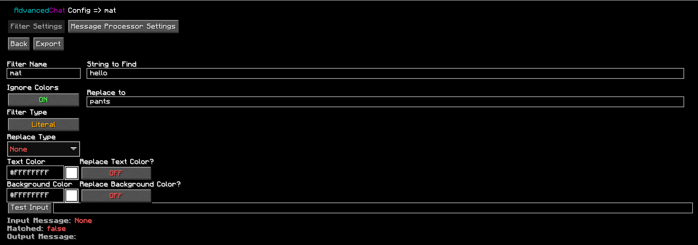

Filters have a variety of configuration options available to you.

The word values are randomized on creation. We recommend changing the name to something meaningful.

## Ignore Colors

This option controls whether the colors are taken into account while filtering. For most purposes, you will want this to be set to the default (true) so that the filter works regardless of the text color.

# Filter Type

## Literal

This option matches the inputted string exactly. There's not much to it.

## Upper-Lower

This option matches the string exactly, but ignores case. This is the equivalent of using the `i` global flag with regex.

## RegEx

This option parses the string like a Regular Expression. This gives you considerable control of the matches. Global modifiers are supported by inputting `(?<modifiers>)` before your regex.

## Custom

This option enables premade filters to be activated. Currently, it only supports profanity. Use this by inputting `profanity` in the Find String box.

# Replace Type

## None

This option replaces nothing, ignoring the replace string. This is usually used in conjunction with Message Processors. 

## Only Match

This option is the default. It replaces only the matched part of the string.

## Full Message

This option replaces the full message with the replace string.  

# Colors

The text and background color options allow you to change the look of the replaced text. Formatting codes will override these. When using these, make sure to turn on the Replace Text Color option.

# Testing

At the bottom of the window there is a Test Input box. You can use this to test your filter within the config.